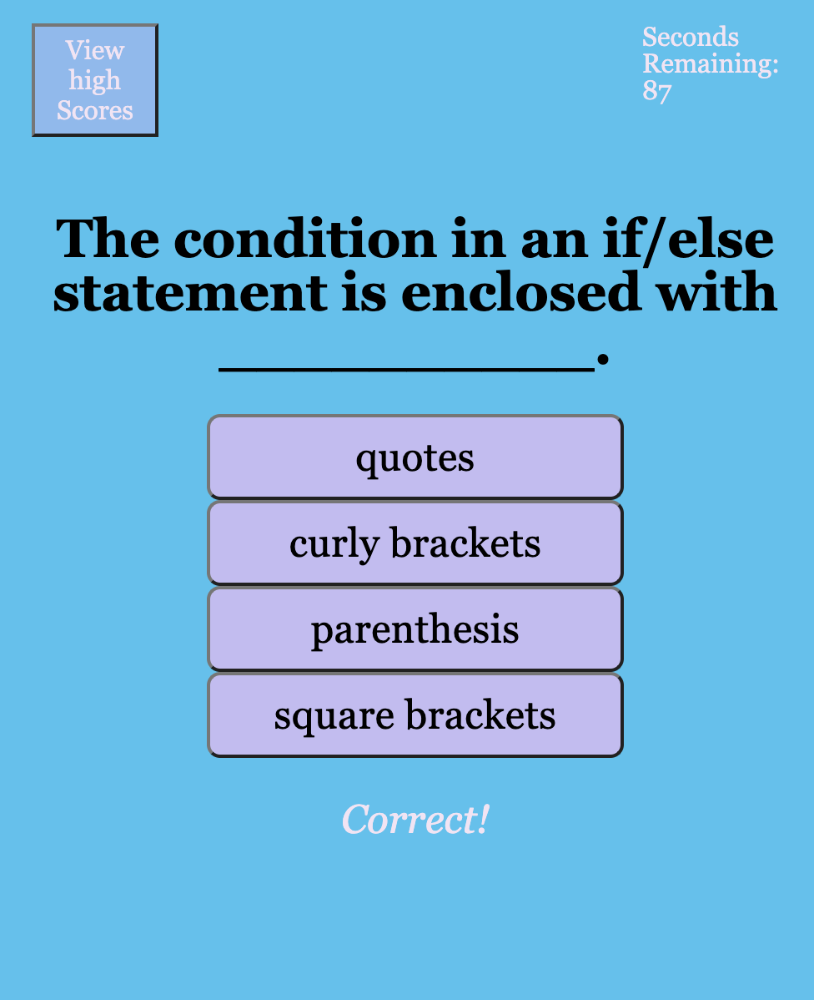

# Code-Quiz
## Description
The purpose of this project was to create a coding quiz for users to practice their coding knowledge. As a user, you will progress through ten multiple choice questions. When time runs or when the user has completed the ten questions, the quiz will end. Once the quiz ends, the user will be presented with their final score and a textbox to enter their name. Once the user hits submit, their name will display on the scoreboard. The user can then choose to play again. 

## How To
Deployed Application: https://bralvis2.github.io/Code-Quiz/

To use this application, click on the link provided above. On the main screen, read the instructions and click on the purple start button. Read each question and answer options. Click on the correct answer. If the answer is correct, you will see a correct message and be prompted with the next question. If the answer is incorrect, you will see a message reading incorrect, try again. Attempt the question until you’ve answered correctly.  Users have 100 seconds to complete this ten question quiz. At the end of the quiz, save your name by typing it into the textbox and click save. Your saved name and score will appear on the high score board. Then you can click on the play again button to restart the quiz.

## ISSUES
I have had a difficult time with line 133 in my javascript code. Currently, I purposely have it as the answer not equal to the correct answer to allow the user and grader of this quiz to progress through the quiz. When the answer is strictly equal to the correct answer, the quiz will not progress past the first question. The user will be given the incorrect message. The time will decrease by ten seconds and the score will decrease by 5 points.. It seems that I have a bug that will not allow the javascript to read the correct answer appropriately. Additionally, the view high scores button is not functional. Lastly, the play again button on the end of the quiz, doesn’t quite restart the quiz perfectly. I would appreciate some feedback on these specific issues. Thank you in advance. 

## Resources
* stack overFlow
* geeksforgeeks.org 
* w3schools

